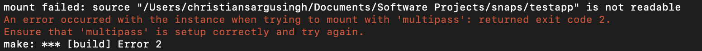
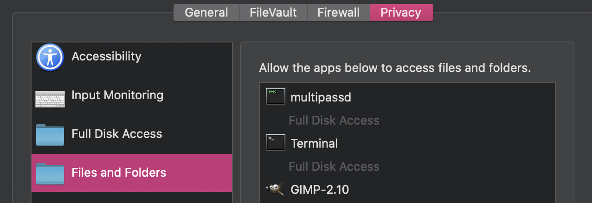

# Setup for Snap Development

## Notes
Currently neither `multipass` or `lxd` have support for cross-platform builds without the use of https://snapcraft.io/build or `snapcraft remote-build`. These solutions are only supported for open-source project development.

## MacOSX

Note: For MacOSX development only amd64 architectures can be built and tested.

Homebrew has a package for snapcraft development:
```bash
brew install snapcraft
```

In order to build, install and test the snap a ubuntu container will be required. The default container for snapcraft development is `multipass`. Multipass is a tool to launch and manage VMs on Windows, Mac and Linux that simulates a cloud environment with support for cloud-init.
```bash
brew cask install multipass
```

## Troubleshooting

### Mounting Permissions
If a mount error occurs like the one below:


You need to give `multipassd` explicit access to your disk in order for the mount to be successful. Visit the *System & Privacy* tab in *System Preferences* then check the boxes for `multipassd`. Once applied you should see the access permissions displayed:



### Unknown cmd bdist_wheel

During a part build via the `python` plugin, wheels for package requirements fail to build:
```bash
Building wheels for collected packages: strictyaml, crontab
  Building wheel for strictyaml (setup.py) ... error
  ERROR: Command errored out with exit status 1:
   command: /root/parts/yacron/install/bin/python3 -u -c 'import sys, setuptools, tokenize; sys.argv[0] = '"'"'/tmp/pip-install-lnqmppfw/strictyaml/setup.py'"'"'; __file__='"'"'/tmp/pip-install-lnqmppfw/strictyaml/setup.py'"'"';f=getattr(tokenize, '"'"'open'"'"', open)(__file__);code=f.read().replace('"'"'\r\n'"'"', '"'"'\n'"'"');f.close();exec(compile(code, __file__, '"'"'exec'"'"'))' bdist_wheel -d /tmp/pip-wheel-u1b28js2
       cwd: /tmp/pip-install-lnqmppfw/strictyaml/
  Complete output (6 lines):
  usage: setup.py [global_opts] cmd1 [cmd1_opts] [cmd2 [cmd2_opts] ...]
     or: setup.py --help [cmd1 cmd2 ...]
     or: setup.py --help-commands
     or: setup.py cmd --help
  
  error: invalid command 'bdist_wheel'
  ----------------------------------------
  ERROR: Failed building wheel for strictyaml
  Running setup.py clean for strictyaml
```

Further details can be found in [this forum](https://forum.snapcraft.io/t/error-invalid-command-bdist-wheel/18960). But in short, the solution is twofold:
1. Add the `python3-wheel` to the `stage-packages` requirements for the part in question.
2. Due to a bug in `snapcraft`, the `dist-packages` directory is not included in `$PYTHONPATH` by default which means that `python3-wheel` dependancies will not be found. We have to add the `dist-packages` directory explicitly to the `$PYTHONPATH`.

The cumulative changes are detailed in this sample part:
```yaml
parts:
  testapp:
    plugin: python
    source: .
    # fix for sys.path not including dist-packages for wheel
    build-environment:
      - PYTHONPATH: "$SNAPCRAFT_PART_INSTALL/usr/lib/python3/dist-packages"
    stage-packages: # packages required for part to run (with python plugin)
      - python3-wheel
      - ncbi-blast+
```

## Ubuntu Server 20.04 (RPi)

Note: For Ubuntu Server 20.04 development only `arm64` architectures can be built and tested.
